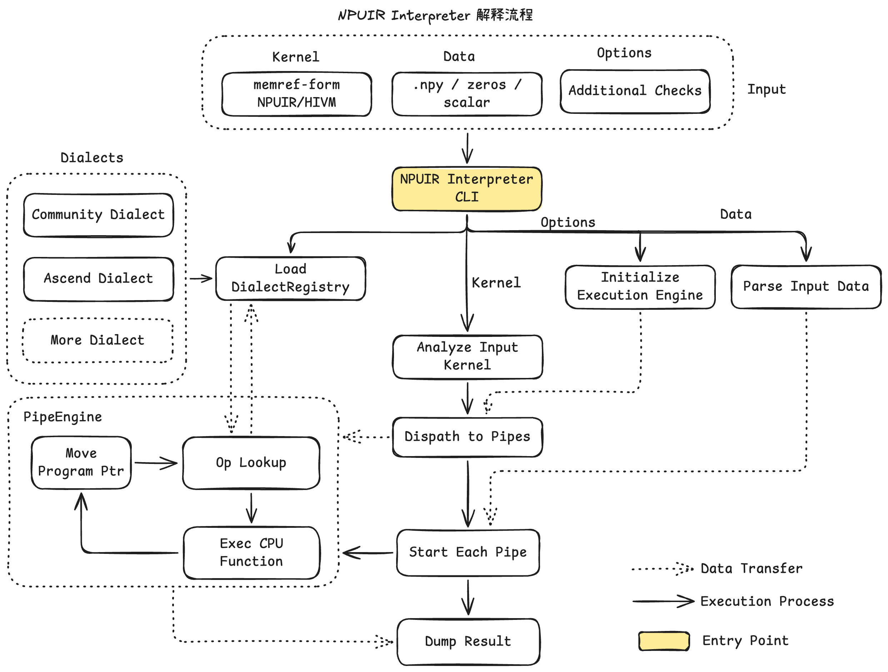

# NPUIR Interpreter

NPUIR Interpreter 是面向 **memref-form NPUIR（HIVM）** 的 CPU 解释器。它可以在
没有 Ascend 设备和 CANN Runtime 的环境中执行编译后的 kernel，并检查数值结果与
运行期同步语义。

核心能力：

- 通过 `inorder`、`lazy` 和 `fuzz` 三种调度模式执行 NPUIR；
- 模拟 S、V、M、MTE 等流水线的延迟提交与同步；
- 检测缺失同步、跨核数据竞争、死锁、越界访问和 layout 不一致；
- 通过独立 debug 二进制记录每步 pipe、同步和内存状态，并可视化回放；
- 使用 APInt/APFloat 覆盖 f16、bf16、f8 等低精度数值路径；
- 读取和输出 `.npy`，便于与 NumPy、PyTorch golden 结果比较。

解释器运行时不依赖 Ascend 硬件。
## 整体架构



关键设计是**延迟提交**：带 pipe 的 op 不会在发射时立即修改内存，而是把 effect
放入对应的 `PipeEngine` 队列，只在 flag、barrier 或返回等硬件语义允许的位置提交。
因此缺失同步不会被主机程序顺序掩盖，而会表现为明确诊断、毒值、竞争或死锁。

## 项目结构

| 路径 | 内容 |
|---|---|
| `include/bishengir/Tools/Interp/` | 解释器公开接口：运行时值、内存、流水线与调度器 |
| `lib/` | 核心实现，以及按 op 家族拆分的 handler |
| `tools/` | `npuir-interp` 命令行入口 |
| `docs/` | 使用指南、架构设计与文档索引 |
| `unittests/` | `Value`、`ShadowMemory`、`PipeEngine` 等 gtest 单元测试 |
| `test/` | lit 功能、同步、竞争、死锁、越界、layout 和错误用例 |
| `test/Precision/` | 独立的低精度逐位扫描工具 |
| `third_party/AscendNPU-IR/` | 固定版本的 AscendNPU-IR submodule |
| `third_party/triton-ascend/` | 固定版本的 Triton Ascend submodule |
| `build.sh` | LLVM external project 的配置、构建与测试入口 |

## 获取源码

```bash
git clone --recursive https://github.com/Skyminers/NPUIR-Interpreter.git
cd NPUIR-Interpreter
```

已有普通 clone 时补齐 submodule：

```bash
git submodule update --init --recursive
```

## 构建与测试

需要 CMake、Ninja、Python 3，以及支持 C++17 的编译器。

```bash
./build.sh
```

默认目标会构建工具，并运行 lit 回归、gtest 单元测试和四组精度扫描。产物位于
`build/bin/npuir-interp`；调试版本位于 `build/bin/npuir-interp-debug`。

日常开发可以按需运行单个目标：

```bash
./build.sh --target npuir-interp
cmake --build build --target check-npuir-interpreter
cmake --build build --target check-npuir-interpreter-unit
cmake --build build --target check-npuir-interpreter-precision
```

```bash
test/dsl_e2e/setup_venv.sh
source .venv/bin/activate
```

构建环境、LLVM 缓存、自定义 Python 和排障说明见
[DSL E2E 环境文档](test/dsl_e2e/README.md)。安装后运行全部用例：

```bash
python test/run_dsl_e2e.py --triton-python "$VIRTUAL_ENV/bin/python"
```

该命令依次验证基础逐元素算子以及真实的行级 `softmax`、`layer_norm` 和
`flash_attention`、`swa`、`linear_attention` 的 DSL → TTAdapter →
GraphSyncSolver HIVM → Interpreter 链路；
可用 `--case flash_attention` 单独运行一个用例。每个用例都会比较
lazy/inorder 调度的输出，并执行一次 fuzz 调度。

用例位于 `test/dsl_e2e/cases/`，每个 Python 文件完整定义一个 Triton kernel、
编译签名、解释器参数、关键 HIVM op 和数值参考。新增同目录文件后，
`dump_ttadapter.py` 与 `run_dsl_e2e.py` 会自动发现，无需维护集中式用例表。

单个用例可以直接生成可视化调试会话。例如：

```bash
python test/dsl_e2e/cases/flash_attention.py --debug --serve
```

命令会同时完成 lazy/inorder 输出比较、数学参考值校验和 fuzz 调度，然后自动打开
调试页面。产物保存在 `build/debug/flash_attention/`；详细参数见
[可视化调试器文档](docs/Debugger_zh.md)。

## 快速使用

```bash
build/bin/npuir-interp kernel.mlir \
  --sched=lazy \
  --args=a.npy,b.npy,zeros \
  --out=out.
```

启动统一的运行与调试 Web 入口：

```bash
python3 tools/interpreter_web.py
```

页面既可以选择 NPY 参数并直接运行 HIVM/MLIR、预览输出并按 `atol`/`rtol` 比较数学
期望值，也会识别未完全下降的 TTAdapter IR，自动生成可下载的 post-GraphSyncSolver
HIVM。运行后可以一键重放本次执行或加载历史 JSONL。命令行生成调试会话仍然可用：

```bash
build/bin/npuir-interp-debug kernel.mlir \
  --sched=lazy --args=a.npy,b.npy,zeros \
  --debug-output=npuir-debug.jsonl
```

随后切换到 Web 页的“日志重放”并加载该 JSONL。调试器可逐步观察每条 pipe 的任务、
core 阻塞、flag/barrier 以及任意 arena 地址的实际字节值。详细说明见
[可视化调试器文档](docs/Debugger_zh.md)。

完整参数、调度模式和诊断示例见[中文使用指南](docs/Usage_zh.md)。实现原理见
[中文架构文档](docs/Architecture_zh.md)或[English architecture](docs/Architecture.md)；
全部文档入口见 [`docs/README.md`](docs/README.md)。

## 依赖版本

AscendNPU-IR 通过 `third_party/AscendNPU-IR` submodule 固定到来源分支
`feature/regbase` 的提交 `5a744afc17c0caa6833cf04f773898450041ff98`；Triton Ascend
通过 `third_party/triton-ascend` 固定到 v3.2.2 兼容线的提交
`2c7d3bbf9ad5b3343db04701355cdce4370fe342`。该提交来自项目兼容 fork，保留与当前
BiShengIR 匹配的 TTAdapter 接口，同时包含 macOS 源码构建修复。不要通过复制生成
头文件或混用其他 LLVM 构建目录替换它们。升级依赖时应提交新的 gitlink，并运行
DSL E2E、完整回归与低精度逐位扫描。

## License

Apache License v2.0 with LLVM Exceptions，详见 [LICENSE.TXT](LICENSE.TXT)。
